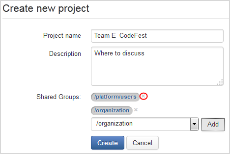

Codefest 2014 team E repository
===========

# The team E

TEAM MEMBER | EXO TEAM
------------ | ------------- 
Tran The Trong | PT
Vu Viet Phuong | PT
Tran Tra Giang | DOC
Nguyen The Tuyen | PT

# How to build

	git clone git@github.com:exo-codefest/2014-team-E.git
	cd 2014-team-E
	mvn clean install


# Responsive

	The MasterTask applications are based on Twitter Bootstrap to be fully responsive support.


# What's MasterTask?
 
With the aim of making easy for managing your jobs more effectively, our team would like to introduce MasterTask - a friendly and easy-to-use task manager.
Even you are good at technique or not, this app is totally in your hand! 
Use this to control projects and their relevant tasks, then share with your group - so simple with MasterTask!

# All to manage your jobs better - MasterTask

We first would like to summarize our ideas, which functions you can be tried now, and which will be next. 
Why? Because of time (2 days for app development) and limitation to members that are required by eXo Jury, 
we decided to finish some main points of our app, and next will be promising featutes and of course a cool delicated User Interface from BD team. 
To make continuous improvements, we are always open to listen to your feedback and expectations. 
See the following diagram to understand the progess of our team for MasterTask: 


<table>
<tr><td>1</td><td>Creating new project </td><td>17</td><td>Feature 1 </td></tr>
<tr><td>2</td><td>Editing project </td><td>17</td><td>Feature 1 </td></tr>
<tr><td>3</td><td>Deleting project </td><td>17</td><td>Feature 1 </td></tr>
<tr><td>5</td><td>Adding collaborators for projects </td><td>17</td><td>Feature 1 </td></tr>
<tr><td>6</td><td>Sorting projects </td><td>17</td><td>Feature 1 </td></tr>
<tr><td>7</td><td>Filtering projects by Project Name and Description </td><td>17</td><td>Feature 1 </td></tr>
<tr><td>8</td><td>Adding task to project </td><td>17</td><td>Feature 1 </td></tr>
<tr><td>9</td><td>Editing task </td><td>17</td><td>Feature 1 </td></tr>
<tr><td>10</td><td>Removing all tasks by selecting all </td><td>17</td><td>Feature 1 </td></tr>
<tr><td>11</td><td>Updating status for specific tasks </td><td>17</td><td>Feature 1 </td></tr>
<tr><td>12</td><td>Sorting tasks by *Created Date* </td><td>17</td><td>Feature 1 </td></tr>
<tr><td>13</td><td>Assigning one task to one </td><td>17</td><td>Feature 1 </td></tr>
<tr><td>14</td><td>Setting priority to one task </td><td>17</td><td>Feature 1 </td></tr>
<tr><td>4</td><td>Addding label to task </td><td>17</td><td>Feature 1 </td></tr>
<tr><td>15</td><td>Fitering tasks by some criteria </td><td>17</td><td>Feature 1 </td></tr>
<tr><td>16</td><td>Adding/Editing/Deleting a comment </td><td>17</td><td>Feature 1 </td></tr>
</table>


# How to use?

## Creating a new project

1. Open the MasterTask app. The MasterTask screen is displayed as follow. 

	

	A list of projects will be displayed. 
	If you have no project, there will be a message: *No project is available, please create one!*. 

1. Click **Create new project** to open the form.

	

1. Enter title and description for your project.

	```
	The asterisk (*) mean the field is mandatory.
	```

1. Select a group to whom you want to share by clicking down-arrow icon to select and click **Add**.

1. Click **Create** to finish.


## Editing a project

1. In the list of projects, click . 
   The **Edit project** form is displayed at the bottom of the projects list.
   
   

2. Make changes to your desires, then click **Update** to finish or **Cancel* to delete your updates.

## Deleting a project

In the list of projects, simply click  to delete a project.

## Managing a project

A project can be considered to represent a team, and in each project, team members can manage their tasks easily and simly. 
By clicking a specific project, you will be redirected to its details as follows:


	
Here is a list of tasks of the project. If this project does not have any task, one message will be shown: "No task is avaible, please create one!".

### Creating a new task

1. Click the project to which you want to add a new task. You will be redirected to details panel of the project as above.

1. Put your cursor into the Quick Add form, then type the task title and hit **Enter** key.

	

	Your newly created task will be updated into the list of tasks at the bottom.

### Deleting a task
	
Simply tick the checkbox corresponding to task you want to delete, then click **Delete** button at the left bottom. You can delete multiple tasks at one time by ticking relevant checkboxes, then click **Delete** button.
	
### Viewing task details

In the list of tasks, simply click one task you want to view. 
Here you will see all information of the task, including: Title of task, Status, Reporter, Created time, Priority, Assignee, and Label, and a list of comments.


### Editing a task

1. Open the details panel of a task.

1. Click  to open the **Edit** form. 
	
	
	
1. Add more details, or make changes on fields you like, including:
	<table>
	<tr><td>**Title</td><td>Change title if you like.</td></tr>
	<tr><td>**Priority**</td><td>Click the down arrow  to select a priority level for your task. 
	Currently, there are 4 levels: BLOCKER, MAJOR, MINOR and UNDEFINED.If you don't set priority, the default value will be UNDEFINED.</td></tr>
	<tr><td>**Status**</td><td>Click the down arrow to update status for your task. Currently, there are 4 types: OPEN, IN PROGRESS, RESOLVED, REFUSED. 
	OPEN is auto set for Status when you create a new task quickly.</td></tr>
	<tr><td>**Assignee**</td><td>Click the down arrow to assign your task to one user. 
	Remember that, only users who are in the **Shared Groups** of the **project** are listed in the drop-down menu. 
	This means that you can only assign this task to one user who belongs to the group with the project has shared.</td></tr>
	<tr><td>**Label**</td><td>Add labels to note your task, then click *Add* button or hit **Enter** key.
	The newly created label will be updated right above the Add Label form. 
	Click **x** next to a label to remove it.</td></tr>
	</table>

1. Click **Update** button to finish your changes, or **Cancel** to exit the Edit Task form without changes.

### Adding comment to a task

1. Click one task to open the **Task Details** view.

2. At the bottom of this view, enter your comment to the text box, then click **Comment** button.

3. Click  to edit your comment, or  to remove it.


