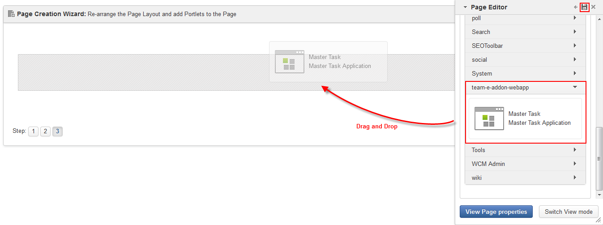
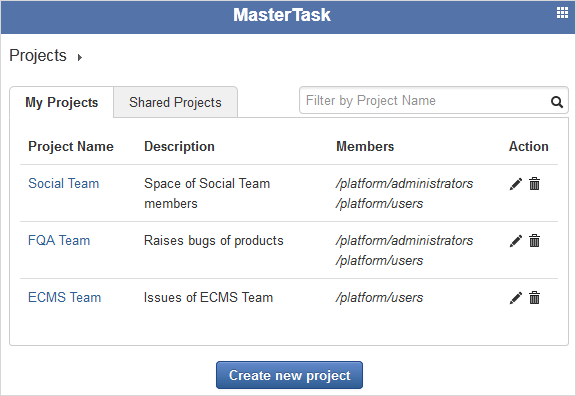
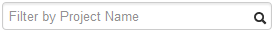

Codefest 2014 team E repository
===========

# The team E

TEAM MEMBER | EXO TEAM
------------ | ------------- 
Tran The Trong | PT
Vu Viet Phuong | PT
Tran Tra Giang | DOC
Nguyen The Tuyen | PT

# How to build

	git clone git@github.com:exo-codefest/2014-team-E.git
	cd 2014-team-E
	mvn clean install

# Responsive

The **MasterTask** app is based on Twitter Bootstrap to be fully responsive support.

# What's MasterTask?
 
With the aim of making easy for managing your jobs, our team would like to introduce **MasterTask** - a friendly and powerful task management tool.
Even you are good at technique or not, this app is totally in your hands! 
Use this app to control projects and their relevant tasks, then share with your group - so simple but effective with **MasterTask**!

# Overview of MasterTask

Because of limitation to time (2 days for app development) and members (maximum 4 members/team) as suggested by eXo Jury, 
our team decided to finish some main points of our app, and next will be promising features and of course a cool User Interface from BD Team. 
See the table to know which you can play now, as well more features that will be introduced soon.

<table>
<tr><td>1</td><td>Creating a new project </td><td>18</td><td>Updating into Activity Stream</td></tr>
<tr><td>2</td><td>Editing a project </td><td>19</td><td>Setting due date for a task </td></tr>
<tr><td>3</td><td>Deleting a project </td><td>20</td><td>Add Repeat options for a task </td></tr>
<tr><td>5</td><td>Sharing a projects with groups </td><td>21</td><td>Making your tasks management more productive by sending timely reminders via notification and email </td></tr>
<tr><td>6</td><td>Sorting projects by 2 tabs </td><td>22</td><td>Adding description for a task</td></tr>
<tr><td>7</td><td>Filtering projects by Project Name and Description </td><td>23</td><td>Adding subtasks to a task </td></tr>
<tr><td>8</td><td>Managing tasks of projects by Dashboard </td><td>24</td><td>Uploading a file into a task </td></tr>
<tr><td>9</td><td>Adding a task to project </td><td>25</td><td>Inviting specific users via email </td></tr>
<tr><td>10</td><td>Editing a task </td><td>26</td><td>Adding/Editing description with CKEditor </td></tr>
<tr><td>11</td><td>Removing a task or all tasks at one time </td><td>27</td><td>Inline editing title and description </td></tr>
<tr><td>12</td><td>Updating status for a specific task </td><td>28</td><td>Synchronizing between Calendar and MasterTask </td></tr>
<tr><td>13</td><td>Assigning a task </td><td>29</td><td>Creating tasks and notes remotely by email to Project_Team@MasterTask.com </td></tr>
<tr><td>14</td><td>Setting priority to one task </td><td>30</td><td>Quick adding a task right from Project Details view </td></tr>
<tr><td>15</td><td>Adding labels to a task </td><td>31</td><td>Adding Task Reporters to control progress more effectively </td></tr>
<tr><td>16</td><td>Filtering tasks by some criteria </td><td>32</td><td>Mention someone in title and description </td></tr>
<tr><td>17</td><td>Adding/Editing/Deleting a comment </td><td>33</td><td>Clean and very easy-to-use interface </td></tr>
</table>

**References:**

* Track issues, bugs and improvements for **MasterTask**, and give your expectations or any feedback at https://github.com/exo-codefest/2014-team-E/issues.

* See the following diagram to understand our plan for **MasterTask**: 

# How to use?

If you are not familiar with adding an app to a page, do as follows to access **MasterTask**:

1. Open the eXo Platform link of **4.1-M2-codefest-team_e** on Acceptance (https://acceptance.exoplatform.org/).

1. Log in Intranet as admin account (for example default - username: gatein & password: gtn).

1. At the top administration bar, select **Administration --> Applications**.

1. Click **Import Applications** button, then click **OK** in the confirmation message to import all gadgets and portlets.

1. Click eXo brand icon at the top left corner to come back to the Intranet homepage.

1. At the top administration bar, click **Edit --> Page --> Add Page** to create a page where **MasterTask** will be stored.

1. Enter **Node Name**, for example **page1**, then click **Next**.

1. Select **Empty Layout**, and click **Next**.

1. In **Page Editor --> Applications tab**, scroll to find the name of **MasterTask** - **team-e-addon-webapp**. 

1. Click **team-e-addon-webapp** to see the name of our app: **MasterTask**.

1. Drag **MasterTask** app from Page Editor and drop it into Page Layout.

	

1. Click  to accept these changes.
You will be redirected to the page that contains **MasterTask**. 
In this case, it will be: http://codefest-4.1-m2-codefest-team_e.acceptance5.exoplatform.org/portal/intranet/home/page1.
Now, you can enjoy **MasterTask**! 

## Creating a new project

1. Access the **MasterTask** app.
	
	
	A list of projects will be displayed. 
	If you have no project, there will be a message: *No project is available, please create one!*. 

1. Click **Create new project** button at the bottom.

	

1. Enter **Project name** (mandatory) and **Description** for your project.

1. Share your project with a group by clicking the down-arrow icon of **Shared Groups**, then click **Add**. 
	This means members of the shared groups can work on that project in the **Shared Projects** tab.

	* Repeat this step if you want to shared with many groups.
	
	* Click  next to each selected group if you don't want to share with that group anymore.
	
1. Click **Create** button to finish.

## Sorting your projects

To find your needed projects quickly, click either of tabs:

* **My Projects**: Lists projects that are created by yourself.

	
	
	* Here, you can make any changes to your desires or delete your own projects.
	
* **Shared Projects**: Lists projects that another shared with groups where you are member.

	
	
	Here, you can:
	
	* See information of shared projects, including: **Project Name**, **Description**, **Owners** and **Members**.
	
	* View details of shared projects, and can do actions regarding to tasks of that project (for example, creating new, editing, or deleting, commenting).
	
	* However, you have no right to make changes on information of the shared projects themselves or delete them.
	
## Filtering projects

After sorting your projects by either of above tabs (**My Projects** & **Shared Projects**), 
you may still find difficult to find exactly your projects because of so many. 
In this case, you can continue filter your project by name or description from the list of selected tab as follows:

1. Type key words into the mini filter form.

	

2. Hit **Enter** key or click  to perform filtering.

The projects that match with your input will be listed in the selected tab.

## Editing a project

1. In the list of projects, click  corresponding to the project you want to edit. 
   The **Edit project** form with the project information is displayed at the bottom of the projects list.
   
   

2. Make changes to your desires, then click **Update** to finish or **Cancel** to delete your updates.

## Deleting a project

In the list of projects, simply click  to delete a project.

A project can be considered to represent a team, and in each project, team members can manage their tasks easily and simply. 
By clicking a specific project, you will be redirected to its details as follows:

	
Here you can: 

* See all tasks of this project. If this project does not have any task, one message will be shown: "No task is available, please create one!".

* The tasks that have been resolved or unresolved or refused are displayed with a strike-through.

* Perform quick actions on each specific task (setting priority, updating status, assigning to one member under the shared groups of a project) by selecting from the drop-down menu.
	For example, to set a new priority, hover your cursor over the current level in **Priority** column, then select another from the drop-down menu.
	
	

## Managing tasks
	
### Using My Dashboard

**MasterTask** allows you to access tasks assigned to you quickly in **My Dashboard**. 
Click  to be redirected to **My Dashboard**.

	
Here, you can see the current status of tasks assigned to you and change status by dragging and dropping one task between column. 
Click the **Projects** text on the breadcrumb to come back to main screen of projects.
	
### Creating a new task

1. Click the project to which you want to add a new task. You will be redirected to details panel of the project as above.

1. Put your cursor into the **Quick Add** form, then type the task title and hit **Enter** key.

	

	Your newly created task will be updated into the list of tasks at the bottom.

### Deleting a task
	
* Simply tick the checkbox corresponding to task you want to delete, then click **Delete** button at the left bottom. 

* Delete multiple tasks at one time by ticking relevant checkboxes, then click **Delete** button.

* Delete all tasks of the project at one time by ticking the first checkbox next to **Task**.
	
### Viewing task details

In the list of tasks, simply click one task you want to view. 
Here you will see all information of the task, including: **Title of task**, **Status**, **Reporter**, **Created time**, **Priority**, **Assignee**, **Label**, and **Comments**.

### Editing a task

As stated above, some information of a task can be directly changed into the Tasks View panel, including: setting priority, updating status, and assigning.
Besides, to make more changes, you can edit in the Details view of each task as follows:

1. Click one task to open the Task Details view.

	

1. Click  to open the **Edit** form. 
	
	
	
1. Add more details, or make changes on fields you like, including:

	* **Title**: Changes title if you like.

	* **Priority**: Clicks the down-arrow icon to select a priority level for your task. 
	Currently, there are 4 levels: BLOCKER, MAJOR, MINOR and UNDEFINED. If you don't set priority, the default value will be UNDEFINED.

	* **Status**: Clicks the down-arrow icon to update status for your task. Currently, there are 4 types: OPEN, IN PROGRESS, RESOLVED, REFUSED, 
	in which OPEN is set for Status by default.
	
	* **Assignee**: Clicks the down-arrow icon to assign your task to one user. 
	Remember that, only users who are in the **Shared Groups** of the **project** are listed in the drop-down menu. 
	This means that you can only assign this task to one user who belongs to the group with the project has shared.
	
	* **Label**: Adds labels to note your task, then click **Add** button or hit **Enter** key.
	The newly created label will be updated right above the Add Label form. 
	Click **x** next to a label to remove it.

1. Click **Update** button to finish your changes, or **Cancel** to exit the Edit Task form without changes.

### Adding comment to a task

1. Click one task to open the **Task Details** view.

1. At the bottom of this view, enter your comment to the text box, then click **Comment** button.

1. Click  to edit your comment, or  to remove it.
